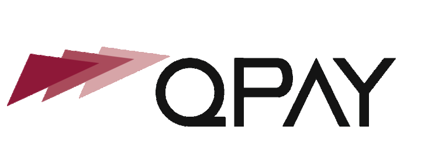
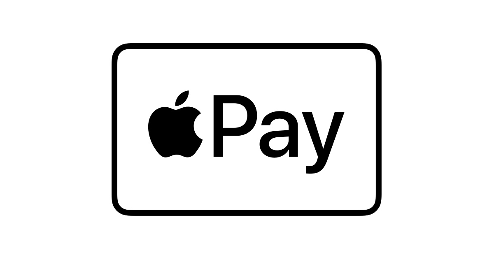
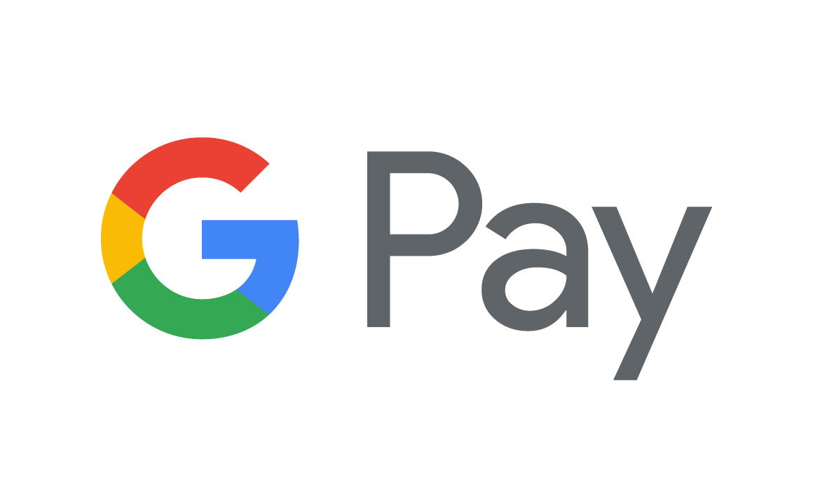

# Smart MyFatoorah Gateway for WooCommerce

Production-oriented WooCommerce payment gateway built on [MyFatoorah](https://www.myfatoorah.com/) APIs.  
It recommends the best **local method** for the customer’s country when available, with Visa/Mastercard and optional Apple Pay / Google Pay — without collecting raw card data in WordPress.

**Author:** [Aymen Ali](https://github.com/aymentucker) (`aymentucker`) · Qatar

---

## Supported payment methods

| Local (by country) | Cards & wallets |
| --- | --- |
|  **QPay** — Qatar |  **Visa / Mastercard** |
|  **KNET** — Kuwait |  **Apple Pay** *(optional)* |
|  **Benefit** — Bahrain |  **Google Pay** *(optional)* |
|  **Mada** — Saudi Arabia | |
|  **STC Pay** — Saudi Arabia | |
|  **Meeza** — Egypt | |

> Methods appear only when enabled on your MyFatoorah merchant account **and** the customer billing country matches.  
> MyFatoorah accepts payments across **8 markets** in MENA: Kuwait, Saudi Arabia, UAE, Qatar, Bahrain, Oman, Egypt & Jordan — see [myfatoorah.com](https://www.myfatoorah.com/).

---

## Highlights

- **Country-aware routing** for regional local methods (QPay, KNET, Benefit, Mada, STC Pay, Meeza)
- **Classic Checkout** and **WooCommerce Checkout Blocks**
- **HPOS** compatibility declared
- **Signed Webhook V2** on `/?wc-api=myfatoorah_webhook` (same URL shape as the official plugin)
- Server-side verification on browser callback before marking an order paid
- Automatic **reconciliation** of pending payments (every 15 minutes, up to 24 hours)
- Operational log: **WooCommerce → MyFatoorah Transactions**
- Checkout appearance: methods per row, logo/text layouts, optional brand colors
- Tabbed settings: **Settings · About · How to use**
- **Arabic** translation included

---

## Requirements

| Requirement | Version |
| --- | --- |
| WordPress | 6.5+ |
| WooCommerce | 8.0+ |
| PHP | 7.4+ |
| MyFatoorah merchant account | [Register](https://www.myfatoorah.com/) / [Demo docs](https://docs.myfatoorah.com/docs/get-started) |
| HTTPS | Required for Live mode |

Deactivate the **official** MyFatoorah WooCommerce plugin when using Smart, so only one handler owns `/?wc-api=myfatoorah_webhook`.

---

## Quick start

1. Upload and activate the plugin.
2. Open **WooCommerce → Settings → Payments → Smart MyFatoorah**.
3. Keep **Test mode** on; set **Merchant country** to your MyFatoorah account country.
4. Paste your [API token](https://docs.myfatoorah.com/docs/api-key) and save.
5. Click **Test MyFatoorah connection** and review discovered methods.
6. In MyFatoorah Portal → **Integration Settings → Webhook Settings (V2)**:
   - Endpoint: `https://YOUR-DOMAIN.com/?wc-api=myfatoorah_webhook`
   - Events: `PAYMENT_STATUS_CHANGED` (and `REFUND_STATUS_CHANGED` if needed)
   - Copy the Secure Key into **Webhook Secret Key** in the plugin.
7. Complete sandbox tests, then switch to Live.

Full Arabic setup guide: [`MYFATOORAH-SETUP.md`](MYFATOORAH-SETUP.md)  
Architecture notes: [`docs/ARCHITECTURE.md`](docs/ARCHITECTURE.md) · Go-live checklist: [`docs/GO-LIVE-CHECKLIST.md`](docs/GO-LIVE-CHECKLIST.md)

---

## Payment API design

| Flow | API |
| --- | --- |
| Local methods (QPay, KNET, Benefit, Mada, STC Pay, Meeza) | V2 `InitiatePayment` → discover `PaymentMethodId` → `ExecutePayment` |
| Card / Apple Pay / Google Pay (hosted) | V3 `POST /v3/payments` with `CARD`, `APPLE_PAY`, or `GOOGLE_PAY` |
| Embedded card (optional) | V2 `InitiateSession` + CardView, with hosted V3 fallback |
| Status confirmation | Prefers V3 payment inquiry; V2 `GetPaymentStatus` for V2 invoices |
| Apple Pay domain | `POST /v2/RegisterApplePayDomain` (association file still required from MyFatoorah support) |

Official references:

- [MyFatoorah website](https://www.myfatoorah.com/)
- [Developer documentation](https://docs.myfatoorah.com/docs/get-started)
- [API reference](https://docs.myfatoorah.com/reference)
- [API-based services](https://www.myfatoorah.com/en/api-based-services/)

---

## Security posture

- No full card number, CVV, or OTP is collected or stored by this plugin
- Payment redirect URLs are restricted to trusted MyFatoorah hosts over HTTPS
- Webhook signatures use HMAC-SHA256 + Base64 with `hash_equals()`
- Amount, currency, and order reference checks run before `payment_complete()`
- Live mode requires HTTPS on the site

---

## FAQ

**Why don’t KNET / Mada / Benefit show on checkout?**  
They appear only if MyFatoorah returns them for your merchant account **and** the customer billing country matches. A Qatar-only account typically shows QPay + card.

**Order stays Pending after a successful charge?**  
Confirm Webhook V2 delivery, the webhook secret matches, and the official MyFatoorah plugin is deactivated. Check **MyFatoorah Transactions** and order notes.

**Does Apple Pay work like the official plugin?**  
Domain registration uses the same MyFatoorah API. Checkout uses **hosted** Apple Pay (V3 redirect), not the official embedded `applepay.js` session.

---

## Changelog

See [`readme.txt`](readme.txt) for the full WordPress.org-style changelog. Latest: **1.0.8** (tabbed settings, docs refresh).

---

## License

GPLv2 or later — see [License URI](https://www.gnu.org/licenses/gpl-2.0.html).

This plugin connects to MyFatoorah APIs (Demo or Live regional endpoints). See [myfatoorah.com](https://www.myfatoorah.com/) and your merchant agreement for terms and privacy.

---

## Author

**Aymen Ali** — Flutter / UI-UX / WordPress · [github.com/aymentucker](https://github.com/aymentucker)
